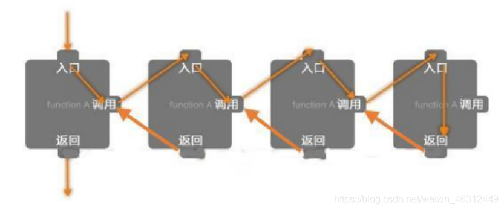

# Recursion 递归

 [^1]

**Bottom up recursion 3 steps:**[^2]
1. Ask for subproblem result
2. Do something in current level of recursion
3. Return result

❗️注意：**递归必须要有一个退出的条件！**

[^1]: [CSDN博客](https://blog.csdn.net/weixin_46312449/article/details/106792544)
[^2]: [图灵星球](https://turingplanet.org/2020/06/20/%e9%93%be%e8%a1%a8linked-list%e9%a2%98%e5%9e%8b%e5%a5%97%e8%b7%af%e3%80%90leetcode%e5%88%b7%e9%a2%98%e5%a5%97%e8%b7%af%e6%95%99%e7%a8%8b4%e3%80%91/)

## Backlinks
- [Leetcode 笔记目录](Leetcode笔记目录.md)
- [206. Reverse Linked List](206-Reverse_Linked_List.md)
- [21. Merge Two Sorted Lists](21-Merge_Two_Sorted_Lists.md)