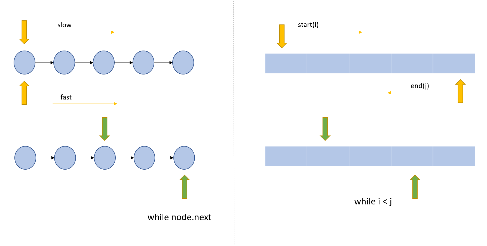

# Two Pointers

参考[图灵星球](https://turingplanet.org/2020/05/20/array-two-pointers%e5%a5%97%e8%b7%af%e3%80%90leetcode%e5%88%b7%e9%a2%98%e5%a5%97%e8%b7%af%e6%95%99%e7%a8%8b2%e3%80%91/)

[^1]

[^1]: [Towards Data Science](https://towardsdatascience.com/two-pointer-approach-python-code-f3986b602640/)

## Backlinks
- [Leetcode 笔记目录](Leetcode笔记目录.md)
- [125. Valid Palindrome](125-Valid_Palindrome.md)
- [15. 3Sum](15-3Sum.md)
- [Linked List](Linked_List.md)